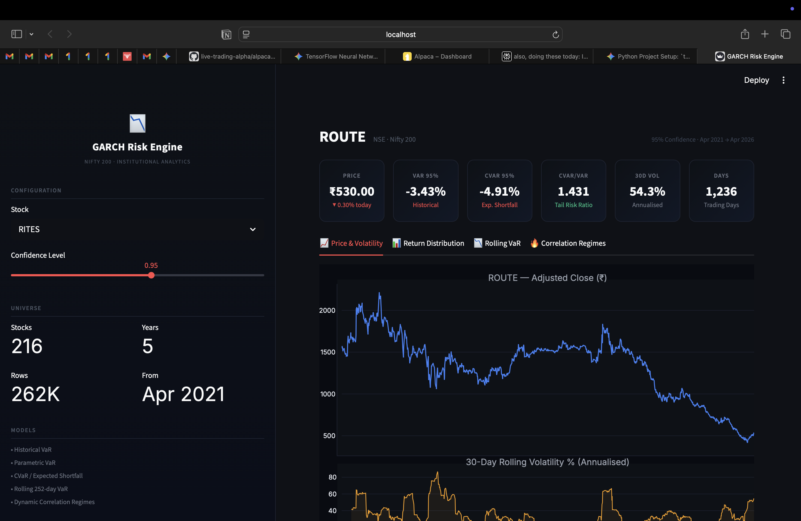
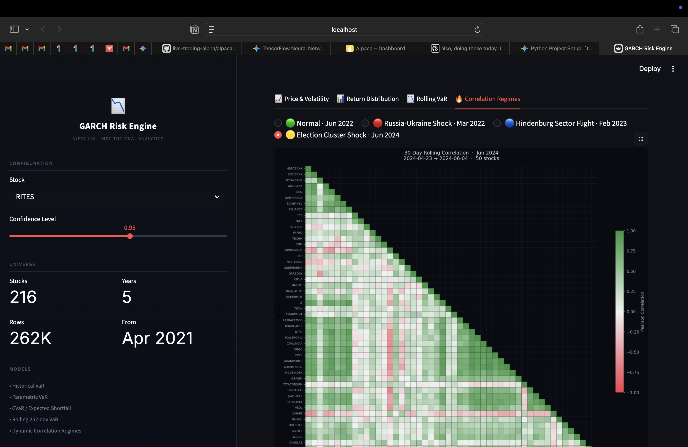

# 📉 GARCH Risk Engine — Vajra Module

> **Part of a 19-week algorithmic trading system for NSE markets.**
> This repository is the **GARCH risk engine** — the "how dangerous is this?" layer
> that feeds into signal generation and portfolio optimisation.


**Vajra answers one question for every stock in the portfolio:**
*"How much can I lose, how volatile is it right now, and how do I size this position?"*
That answer gates every downstream decision in Alpha-Core and Kuber.

***

## Dashboard


*Four-tab Streamlit dashboard — Price & Volatility · Return Distribution ·
Rolling VaR Timeline · Correlation Regime Detector*


***

## Database

| Metric | Value |
|---|---|
| Universe | Nifty 200 (216 tickers) |
| Period | April 2021 → April 2026 |
| Total rows | 262,816 |
| Trading days / stock | ~1,236 |
| Validation | 10/10 checks passing |
| Test suite | 14/14 pytest passing |
| NaN policy | Zero tolerance on `log_return` |

***

## Features — Week 1 Complete

### Data Pipeline
- **Multi-threaded crawler** — `ThreadPoolExecutor` (10 workers), 216 NSE tickers,
  ~196 seconds for full 5-year pull
- **PostgreSQL schema** — `PriceData` + `TickerMetadata` via SQLAlchemy ORM,
  `pool_size=10`, `pool_pre_ping=True`, `UniqueConstraint(ticker, date)`
- **Pre-computed columns** — `log_return` and `rolling_vol_30` written at insert
  time (15ms dashboard refresh vs 300ms lazy recompute)
- **10-point validator** — NULL checks, duplicate detection, extreme return
  flagging, date range verification, spot price spot-check

### Risk Engine (`risk_engine/var_calculator.py`)
- **Historical VaR** — empirical 5th percentile of 1,236 daily returns.
  No distribution assumption. RELIANCE 95% VaR = -2.14%.
- **Parametric VaR** — `VaR = μ − 1.645σ`. Gaussian assumption.
  Directly proportional to daily volatility.
- **CVaR / Expected Shortfall** — `E[X | X < VaR]`.
  Average of the worst 62 days. RELIANCE CVaR = -3.08%.
- **CVaR/VaR ratio** — fat tail detector. ADANIPORTS = 1.93 vs RELIANCE = 1.44.
  Identical VaR, completely different tail severity — the Hindenburg effect.
- **Rolling 252-day VaR** — time series showing risk spiking at
  Russia-Ukraine, Hindenburg, and Election 2024.

### Correlation Regime Detector
Four distinct regimes identified from live NSE data:

| Regime | Date | Mean Corr | % Pairs > 0.7 | What Happened |
|---|---|---|---|---|
| Normal | Jun 2022 | 0.361 | 3.7% | Baseline — diversification working |
| Systemic | Mar 2022 | 0.469 | 13.9% | Russia-Ukraine — global FII selloff |
| Sector Flight | Feb 2023 | 0.142 | 0.8% | Hindenburg — Adani down, IT/pharma up |
| Cluster Shock | Jun 2024 | 0.256 | 12.7% | Election — PSU/infra cluster fell |

> Mean correlation alone is misleading — Hindenburg mean = 0.142 (looks calm)
> but hides violent sector divergence. `% pairs > 0.7` is the real crisis detector.

***

## Key Output

```
─────────────────────────────────────────────────────────
Ticker        VaR 95%    CVaR 95%   CVaR/VaR     N
─────────────────────────────────────────────────────────
RELIANCE       -2.14%      -3.08%      1.44    1236
HDFCBANK       -1.98%      -3.15%      1.59    1236
TCS            -2.02%      -3.11%      1.54    1236
INFY           -2.46%      -3.70%      1.50    1236
ADANIPORTS     -2.95%      -5.70%      1.94    1236
─────────────────────────────────────────────────────────
```

ADANIPORTS CVaR/VaR = 1.94. Hindenburg report caused -19% single-day moves.
VaR predicted -2.95%. Reality was 6× worse. CVaR captured the tail. VaR didn't.
This is why CVaR is mandated over VaR in institutional risk frameworks.

***

## Tech Stack

| Layer | Technology |
|---|---|
| Language | Python 3.11 |
| Database | PostgreSQL 16 + SQLAlchemy ORM |
| Data | yfinance, pandas, numpy |
| Risk math | scipy.stats, numpy |
| Visualisation | Streamlit, Plotly, seaborn, matplotlib |
| Testing | pytest (14/14) |
| Config | python-dotenv |

***

## Structure

```
indian-risk-engine/
├── data_pipeline/
│   ├── db.py                  PostgreSQL engine + connection pool
│   ├── models.py              ORM: PriceData + TickerMetadata
│   ├── crawler.py             Multi-threaded yfinance crawler
│   ├── validate.py            10-point data quality validator
│   └── nifty200_tickers.py    216-stock NSE universe
├── risk_engine/
│   └── var_calculator.py      VaR, CVaR, Parametric, Rolling VaR
├── tests/
│   └── test_returns.py        14/14 pytest — log returns + volatility
├── dashboard/
│   └── app.py                 Streamlit GARCH Risk Engine (4 tabs)
├── notebooks/
│   └── correlation_heatmap.py 4-regime heatmap generator
├── assets/
│   └── dashboard.png          Dashboard screenshot
└── requirements.txt
```

***

## Setup

```bash
# Clone and activate
git clone https://github.com/yashpatil/indian-risk-engine
cd indian-risk-engine
python -m venv venv && source venv/bin/activate
pip install -r requirements.txt

# PostgreSQL
createdb nifty_risk
cp .env.example .env        # add DB credentials

# Pull 5yr Nifty 200 data (~3-5 min)
PYTHONPATH=. python data_pipeline/crawler.py

# Validate 262K rows
PYTHONPATH=. python data_pipeline/validate.py

# Run tests
PYTHONPATH=. pytest tests/ -v

# Launch dashboard
PYTHONPATH=. streamlit run dashboard/app.py
```

***


CFA Level 1 · CCFA Certified · Target: Quantitative / Algo Trading roles